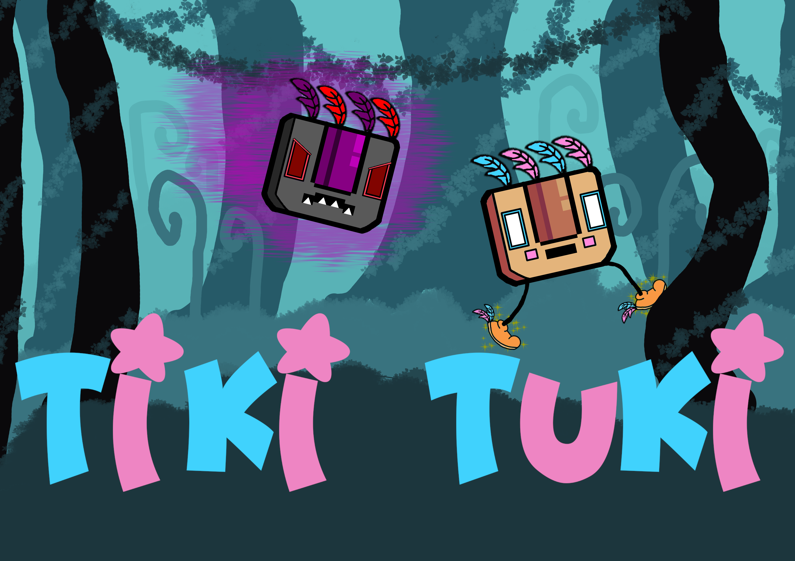

## Context / Purpose

This videogame is a classroom project for the GECEGS **Course in Video Game and Virtual Reality Development** at **CPIFP Alan Turing (Campanillas, Málaga)**.
Its main objective is to apply Unity 2D development concepts, including platforming mechanics, enemies, and item collection.

## Story

**Tuki** and **Taka**, the Tiki brothers, have lived in their native forest for millennia, but they've never really gotten along. Recently, Taka decided to play a trick on Tuki and stole all his apples to eat them all by himself... how mean! He even possessed the other forest animals, ordering them to attack Tuki if he dares disturb his snack!

**Run like the wind and help Tuki get his food back!**

## Mechanics

- **Momentum**: The more the player moves on one direction, the more fast it will go.
- **Apples Collectable**: If you are hit by an enemy, you'll lose all your apples. If the enemys hits the player with no apples, it's game over.
- **Spin Attack**: If the player is running and presses down, it will be capable to defeat the enemies.
- **Enemies**: Pigs, Bees and Bunnies, all of them move differently and will attack the player on their own way.

## Source Code

This project is developed in **Unity 6** with C#. This are the scripts:

- **ActSelectManager**: Loads the different acts of the game, which can only be access if the player beated the level.
- **AudioManager**: Controls the audio of the game, including the background music and SFX.
- **EnemyController**: Controls the movement, logic and the type of the enemy.
- **EnemySpawnerController**: Controls the spawner of enemies on the final battle with Taka.
- **FruitController**: Controls the logic of the apples in the game, including their type.
- **GameConstants**: Contains all the constants of the variables needed for the game to work.
- **GameManager**: Manages the gloval logic of the game, levels and pause.
- **GoalController**: When you win the level shows a panel to go to other levels, or the menu. 
- **MenuManager**: Controles the buttons and panels of the main menu.  
- **UIManager** *(desactivado)*: Gestionaría la activación de elementos gráficos en pantalla como HUD y mensajes.  
- **MobileControlsManager**: Detecta si el dispositivo es móvil y gestiona los controles táctiles.  
- **SimpleJoystick**: Joystick virtual 2D que detecta arrastre táctil para generar un vector de movimiento.  

- **PlayerCollect**: Gestiona la recolección de gemas y notifica al GameManager.  
- **PlayerController**: Controla el movimiento del jugador, saltos y animaciones.  
- **PlayerHealth**: Gestiona la salud del jugador y efectos de PowerUps.  
- **Gem**: Controla el comportamiento de las gemas y efectos visuales al recolectarlas.  
- **PowerUp**: Gestiona los PowerUps (Vida e Invencibilidad) y sus efectos sobre el jugador.

Los scripts incluyen documentación interna y métodos de debug.

## Scoring System

- Cada diamante recolectado incrementa la puntuación del jugador. Al llegar a 10 diamantes avanzamos de nivel. 
- Los PowerUps no incrementan la puntuación directamente, pero ayudan a sobrevivir.  

## Credits

**Development**  
Alberto Fernández Hidalgo  

**Tilesets**  
- Forest Lite Pixel Art Tileset  

**Characters / Sprites**  
- Player Principal: Cute Mushroom Character Sprite  
- Enemigo Hombre-Rana: Isometric Frog Character  
- Enemigo Caracol: Snail Character 2.0  
- Gatos: CatPackFree  
- Águilas: 2DBirds Eagle  

**Animations**  
- Cute Mushroom Character Sprite  
- Isometric Frog Character  
- Snail Character 2.0  
- CatPackFree  
- 2DBirds Eagle  

**Visual Effects (VFX)**  
- msVFX Free Smoke Effects Pack  
- Lana Studio Hyper Casual FX  

**Sounds**  
- Collectables Sound Pack  
- RPG Essentials Free (Leohpaz)  

## Play Now

Play on **Itch.io**:  
[Tiki Tuki on Itch.io](https://bruxter.itch.io/tiki-tuki)

## Special Mentions
Thanks to [Alberto Fernandez Idalgo](https://github.com/albertofernandezhid) for the README base of this project!
